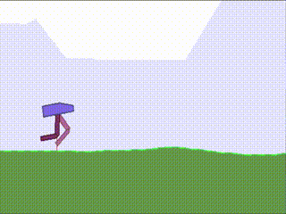

My first successful approach to BipedalWalker OpenAI Gym (and RL in particular)

Solution is basically a DDPG (Deep Deterministic Policy Gradient)

In this solution I also experimented wit a varying (cyclic) noise applied during learning:
at each step `epsilon` noise is applied. At start, `epsilon` equals 0.2 and then
slightly decays until it becomes 0.1. After that, it is set back to 0.2, and so on.

Current implementation has only the learning mode. It also does not yet save any progress.

Here is what the bot could achieve after continuous learning:
